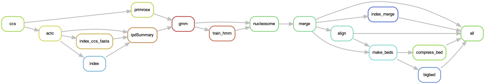

# `fiberseq-smk`: A Snakemake for calling **fiberseq**

[](https://snakemake.github.io)
[](https://github.com/StergachisLab/fiberseq-smk/actions?query=branch%3Amain+workflow%3ATests)

A Snakemake workflow for making **fiberseq** calls.


# Installation

```bash
git clone https://github.com/StergachisLab/fiberseq-smk
cd fiberseq-smk
conda create -n fiberseq-smk
mamba env update -n fiberseq-smk --file workflow/envs/env.yml 
conda activate fiberseq-smk
# Add the SMRTlink tools to your path
export PATH=$PATH:/path/to/smrtlink/tools
```

On the Stergachis Lab's cluster, you can add the following line to your `~/.bashrc` to load the needed `SMRTlink` tools:
```bash
PATH=$PATH:/gscratch/stergachislab/install_dir/smrtlink/smrtcmds/bin/
```

# Usage

You can run data using the following command, read the comments to learn more about the config options:
```bash
snakemake \
  --profile profile/local `# sets up where and how jobs are submitted` \
  --config \
    env="fiberseq-smk" `# sets the conda env for the jobs, always the same` \
    test=.test/subreads.bam `# path to the subreads, and the key sets the sample name` \
    ccs=.test/ccs.bam `# optional, precomputed CCS bam, needed for multiplexed data` \
    ref=.test/ref.fa `# optional, reference to align results to`  
```
If you find this too verbose you can instead include the config options in a configuration file:
```bash
snakemake --profile profile/local --configfile config.yaml 
```
And then specify the options in the `config.yaml`, for example:
```yaml
# sets the conda env for the jobs, always the same
env: fiberseq-smk
# choose any sample name followed by a path to the subreads
test: .test/subreads.bam
# optional path to a reference fasta to align the results to
ref: .test/hg38.analysisSet.fa
# optional path to the ccs bam file to avoid recomputing (required for multiplexed data)
ccs: .test/ccs.bam
```


# Test case
**Before running your own data** please run this small test case included in the repository.

## Local test case
```bash
snakemake \
  --profile profile/local `# sets up where and how jobs are submitted` \
  --config \
    env="fiberseq-smk" `# sets the conda env for the jobs` \
    test=.test/subreads.bam `# path to the subreads, and the key sets the sample name` \
    ccs=.test/ccs.bam `# optional precomputed CCS bam, needed for multiplexed data` \
    ref=.test/ref.fa `# optional, reference to align results to` \
  -p 
```

## Submitting the test case to the cluster 
You can also try submitting this test case to the cluster. Note the profile is currently configured for the Stergachis Lab cluster, you may need to modify it.
```bash
snakemake \
  --profile profile/compute `# sets up where and how jobs are submitted` \
  --config \
    env="fiberseq-smk" `# sets the conda env for the jobs` \
    test=.test/subreads.bam `# path to the subreads, and the key sets the sample name` \
    ccs=.test/ccs.bam `# optional precomputed CCS bam, needed for multiplexed data` \
    ref=.test/ref.fa `# optional, reference to align results to` \
  -p 
```

## Submitting the test case to checkpoint 
Similarly you can submit to the `checkpoint` nodes with: 
```bash
snakemake \
  --profile profile/compute `# sets up where and how jobs are submitted` \
  --config \
    env="fiberseq-smk" `# sets the conda env for the jobs` \
    test=.test/subreads.bam `# path to the subreads, and the key sets the sample name` \
    ccs=.test/ccs.bam `# optional precomputed CCS bam, needed for multiplexed data` \
    ref=.test/ref.fa `# optional, reference to align results to` \
  -p 
```

## Multiplexed data
If you have multiplexed data, you have to pass a `ccs` bam into the pipeline that has already been processed with `lima`. In general, you can pass a pre-generated ccs bam file to save on compute.
# Output files
Example output files if your sample name is `test`:
<table>
<tr>
<th> Unaligned outputs </th>
<th> Aligned outputs </th>
</tr>
<tr>
<td>

```bash 
# bam files 
results/test/unaligned.fiberseq.bam
results/test/unaligned.fiberseq.bam.pbi
# bed files
results/test/unaligned.cpg.bed.gz
results/test/unaligned.m6a.bed.gz
results/test/unaligned.msp.bed.gz
results/test/unaligned.nuc.bed.gz
```
</td>
<td>

```bash
# aligned bam files 
results/test/aligned.fiberseq.bam
results/test/aligned.fiberseq.bam.bai
# aligned bed files
results/test/aligned.cpg.bed.gz
results/test/aligned.m6a.bed.gz
results/test/aligned.msp.bed.gz
results/test/aligned.nuc.bed.gz
# aligned big bed file
results/test/aligned.nuc.bed.bb
results/test/aligned.m6a.bed.bb
results/test/aligned.cpg.bed.bb
results/test/aligned.msp.bed.bb
```
</td>
</tr>
</table>

## Added bam tags and definitions.
- MSP: methylation sensitive patch, defined as being any stretch of sequence between nucleosomes that has methylation.
- as: A bam tag with an array of MSP start sites
- al: A bam tag with an array of MSP lengths
- ns: A bam tag with an array of nucleosome start sites
- nl: A bam tag with an array of nucleosome lengths
- MM/ML: Bam tags for sorting m6a and 5mC methylation information. See the SAM spec for details.

# TODO
- [x] Make an extract tool
- [x] Add primrose
- [x] Add unknown case to end of fiber calls
- [x] Add a ccs input option
- [ ] Add a sample tag to the bam header.
- [ ] Add a pipeline version to the bam header (git commit).
- [ ] Add env version to the output somewhere. 
- [ ] Can we check for de-multiplexing automatically?


# Workflow

